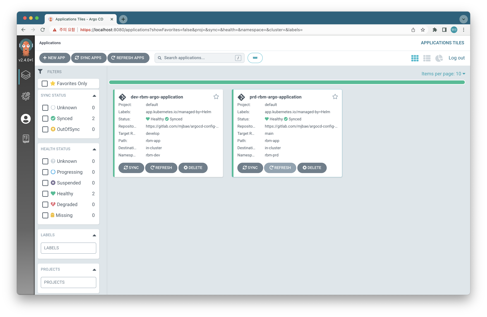
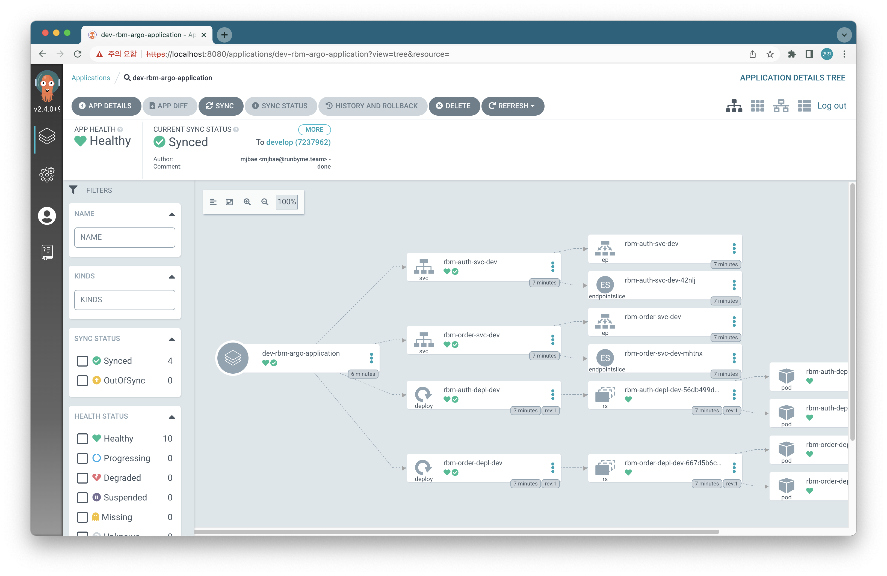

# Runbyme Argo CD with Helm

- mjbae@runbyme.team
- 2022.06.22

로컬에 쉽게 설치 가능한 경량 쿠버네티스 클러스터인 "Minikube" 상에서 테스트 된 버전입니다.




## 환경 설정 (Mac 기준)

- Docker Desktop 설치
- Kubctl 설치
  ```
  brew install kubectl
  ```
- Helm 설치
  ```
  brew install helm
  ```  
- Minikube 설치
  ```
  brew install minikube
  ```
- Miniukbe 실행
  ```
  minikube start
  ```
- argo CD 배포
  ```
  kubectl create namespace argocd
  kubectl apply -n argocd -f https://raw.githubusercontent.com/argoproj/argo-cd/stable/manifests/install.yaml
  ```

## RBM argoCD 어플리케이션 배포

### 배포

  ```
  ./install.sh dev|stg|prd
  ```

### 삭제

  ```
 ./uninstall.sh dev|stg|prd
  ```


## 파일 구조 설명

```
├── README.md
├── install.sh # 설치 스크립트
├── uninstall.sh # 삭제 스크립트
├── rbm-app # 실제 서비스 배포에 관한 Helm 차트
│   ├── Chart.yaml
│   ├── dev
│   │   └── values.yaml
│   ├── prd
│   │   └── values.yaml
│   ├── stg
│   │   └── values.yaml
│   └── templates  # 여기 아래에 실제 배포할 컴포넌트들(Ingress, Deployment 등)의 Manifest를 선언
│       ├── rbm-auth-depl.yaml
│       ├── rbm-auth-svc.yaml
│       ├── rbm-order-depl.yaml
│       └── rbm-order-svc.yaml
├── rbm-argocd  # 서비스 배포를 관리해주는 argo CD 배포에 관한 Helm 차트
│   ├── Chart.yaml
│   ├── dev
│   │   └── values.yaml
│   ├── prd
│   │   └── values.yaml
│   ├── stg
│   │   └── values.yaml
│   └── templates
│       └── application.yaml  # source git 레포지토리와 target 클러스터 주소거 명시되는 파일
└── reference       
    ├── argocd-example.yaml  # argo CD application.yml을 만들 때 참고함
    └── scripts.txt
```


